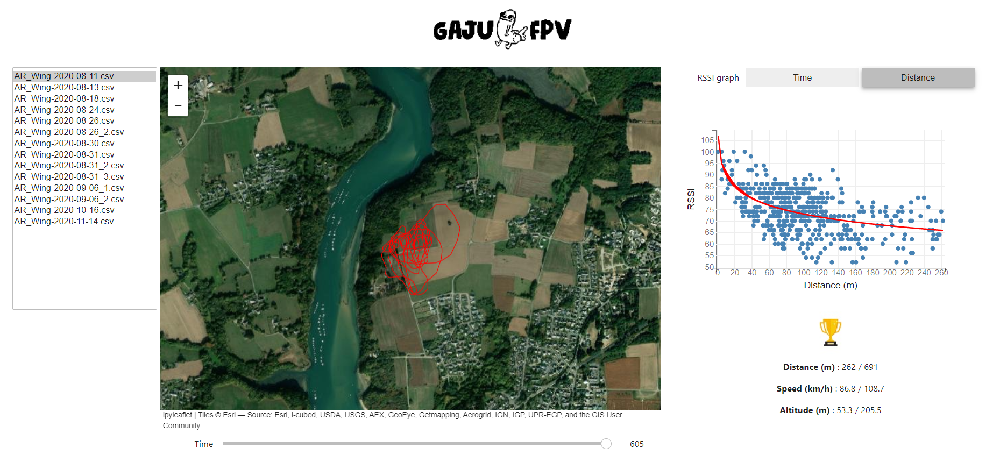

# Telemetry logs App

:hammer_and_wrench: Python application developped with ipywidget, bqplot, ipyleaflet and deploy with voilà and Heroku. 	

:pushpin: It reads telemetry logs files generated by OpenTX and display it. Especially, it draws the GPS route on a map, the main statistics of the flights (distance, speed, altitude) and a graph to explore in more details the other telemetry data (like RSSI, battery, temperature, acceleration ...)

:mag_right: Run it in https://telemetry-logs-app.herokuapp.com/ 

